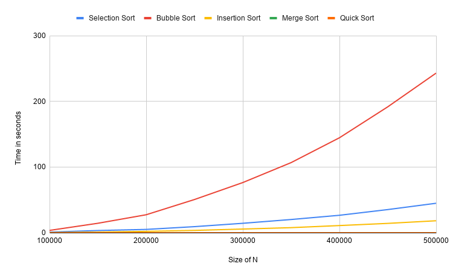
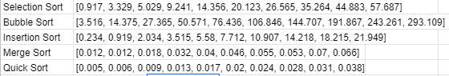

# assignment-01-sorting

# Part 1

# Part 2

**Requirement 1**: RandomizedQuickSort.java

**Requirement 2**: InsertionSort as my quadratic sorting algorithm.

**Requirement 3**: ModifiedQuadraticSort.java

**Requirement 4**: HybridSort.java

# Justification

- I chose to do InsertionSort because, like BubbleSort, InsertionSort's best case time complexity is
O(n), and I figured since we'd be implementing some kind of hybrid sort between a quadratic sort + quick sort
it'd make sense to use a best case O(n) algorithm since the average and worst cases are all the same for every
quadratic sort.

- In my implementation of hybridSort, we check to see if the size of the array is less than 500, if so we perform insertion sort, else we perform the randomised quicksort.

- We can also 'optimize' or change the size of the array that determines whether or not we perform quadratic sort in hybridSort. We can do this by comparing the runtime between the quadratic sorting algorithm and the randomized quick sort algorithm for different array sizes.  